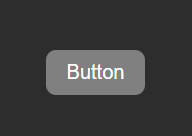
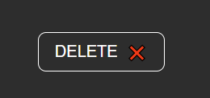
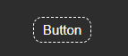
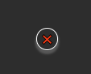

# Button Component

A customizable Button component built with React and Emotion.

## Table of Contents

- [Installation](#installation)
- [Examples](#examples)
- [Usage](#usage)
- [Contributing](#contributing)
- [License](#license)

## Installation

Install the package via npm:

```sh
npm install your-button-package
```

You also need to install the peer dependencies:

```sh
npm install @emotion/react @emotion/styled
```
## Examples







## Usage

Here's an example of how to use the Button component in your project:

```ts
/** @jsxImportSource @emotion/react */
import React, { useState, useEffect } from "react";
import Button from "@flyckt-coding/buttons";

function App() {
  const [buttonState, setButtonState] = useState<
    "normal" | "loading" | "success" | "error"
  >("normal");

  useEffect(() => {
    if (buttonState === "loading") {
      // Simulate a network request
      setTimeout(() => {
        setButtonState("success");
        setTimeout(() => {
          setButtonState("error");
        }, 2000);
      }, 2000);
    }
  }, [buttonState]);

  const handleClick = () => {
    setButtonState("loading");
  };

  const adaptiveText = {
    normal: "Click me",
    loading: "Loading...",
    success: "Success!",
    error: "Error!",
  };

  return (
    <Button
      ClassName="custom-button"
      id="test-button"
      bgColor="blue"
      imgPath="/path/to/image.png"
      imgAlt="Button Image"
      imgClassName="button-image"
      icon={<span>🔔</span>}
      iconPosition="left"
      variant="primary"
      size="large"
      margin="10px"
      padding="15px"
      onClick={handleClick}
      disabled={false}
      ariaLabel="Test Button"
      adaptiveText={adaptiveText}
      buttonState={buttonState}
      text="Button"
      fullWidth={true}
      tabIndex={0}
      onFocus={() => console.log("Focused")}
      onBlur={() => console.log("Blurred")}
      color="white"
      borderRadius="5px"
      isRound={false}
      shadow="2px 2px 4px rgba(0, 0, 0, 0.1)"
      hoverStyles={{ backgroundColor: "red" }}
      focusStyles={{ outline: "2px solid blue" }}
      activeStyles={{ backgroundColor: "green" }}
      type="button"
      borderStyle="solid"
    >
      Button Content
    </Button>
  );
}

export default App;
```

## Props

The Button component accepts the following props:
| Prop | Default Value | Description |
|----------------|----------------------------------------------------------|---------------------------------------------------------------------|
| `className` | `""` (empty string) | Custom class name for the button |
| `id` | `undefined` | ID for the button |
| `bgColor` | `""` (empty string) | Background color for the button |
| `imgPath` | `undefined` | Image path for the button |
| `imgAlt` | `undefined` | Image alt text for the button |
| `imgClassName` | `undefined` | Class name for the image |
| `icon` | `undefined` | Icon for the button |
| `iconPosition` | `"left"` if `icon` is provided, otherwise `undefined` | Icon position (left, center, right) |
| `variant` | `"default"` | Button variant (default, primary, secondary, tertiary, icon, outlined)|
| `size` | `"medium"` | Button size (small, medium, large) |
| `margin` | `""` (empty string) | Margin for the button |
| `padding` | `""` (empty string) | Padding for the button |
| `onClick` | `() => alert("Button Clicked!")` | Click event handler |
| `disabled` | `undefined` | Disable the button |
| `ariaLabel` | `undefined` | ARIA label for the button |
| `adaptiveText` | `undefined` | Object with text for different button states (normal, loading, success, error) |
| `buttonState` | `"normal"` | Current state of the button (normal, loading, success, error) |
| `text` | `"Button"` | Default text of the button |
| `fullWidth` | `undefined` | Make the button full width |
| `tabIndex` | `undefined` | Tab index for the button |
| `onFocus` | `undefined` | Focus event handler |
| `onBlur` | `undefined` | Blur event handler |
| `color` | `""` (empty string) | Text color of the button |
| `borderRadius` | `""` (empty string) | Border radius of the button |
| `isRound` | `undefined` | Make the button round |
| `shadow` | `undefined` | Box shadow for the button |
| `hoverStyles` | `undefined` | Styles to apply on hover |
| `focusStyles` | `undefined` | Styles to apply on focus |
| `activeStyles` | `undefined` | Styles to apply on active state |
| `type` | `"button"` | Button type (button, submit, reset) |
| `borderStyle` | `undefined` | Border style of the button (solid, dotted, dashed) |
| `children` | `undefined` | Content to be rendered inside the button |


## Styling
The default styling applied are:
| Style Property       | Default Value                                                                 | Description                                                           |
|----------------------|-------------------------------------------------------------------------------|-----------------------------------------------------------------------|
| `display`            | `flex`                                                                        | Makes the button use flexbox for layout.                              |
| `justify-content`    | `center`                                                                      | Centers the content horizontally within the button.                   |
| `align-items`        | `center`                                                                      | Centers the content vertically within the button.                     |
| `padding`            | `0.5rem 1rem`                                                                | Default padding for the button (0.5 rem vertically, 1 rem horizontally). |
| `border-radius`      | `0.5rem`                                                                     | Rounded corners for the button.                                       |
| `font-size`          | `1rem`                                                                        | Default font size for the button.                                     |
| `border`             | `1px solid transparent`                                                      | Transparent border, but with 1px spacing.                             |
| `cursor`             | `pointer`                                                                     | Shows the pointer (hand) when hovering over the button.               |
| `background-color`   | `gray`                                                                       | Default background color for the button (gray).                       |
| `color`              | `white`                                                                      | Default text color for the button (white).                            |
| `border-style`       | `transparent`                                                                | Default border style for the button (transparent).                    |
| `box-shadow`         | `2px 2px 4px rgba(0, 0, 0, 0.1)`                                            | Default shadow for the button (light shadow).                         |
| `&:hover`            | `background-color: #f6f6f650`                                                | Background color when hovering (lighter gray).                        |
| `&:focus`            | `background-color: transparent`                                             | No change on focus, except for default style adjustments.              |
| `&:active`           | `background-color: #f6f6f650`                                                | Background color when the button is active (temporarily lighter).     |
| `background-color`   | `gray`                                                                       | For `default` variant, gray background.                               |
| `border`             | `1px solid transparent`                                                      | For `default` variant, transparent border.                            |
| `color`              | `white`                                                                      | For `default` variant, white text color.                              |
| `&:hover`            | `background-color: #f6f6f650`                                                | For all variants on hover (lighter gray).                             |
| `&:active`           | `background-color: #f6f6f650`                                                | For all variants on active state (lighter gray).                      |
| `background-color`   | `blue`                                                                       | For `primary` variant, blue background.                               |
| `border`             | `1px solid blue`                                                             | For `primary` variant, blue border.                                   |
| `color`              | `white`                                                                      | For `primary` variant, white text color.                              |
| `background-color`   | `green`                                                                      | For `secondary` variant, green background.                            |
| `border`             | `1px solid green`                                                            | For `secondary` variant, green border.                                |
| `color`              | `white`                                                                      | For `secondary` variant, white text color.                            |
| `background-color`   | `purple`                                                                     | For `tertiary` variant, purple background.                            |
| `border`             | `1px solid purple`                                                           | For `tertiary` variant, purple border.                                |
| `color`              | `white`                                                                      | For `tertiary` variant, white text color.                             |
| `background-color`   | `transparent`                                                                | For `icon` variant, transparent background.                           |
| `border`             | `none`                                                                       | For `icon` variant, no borders.                                       |
| `padding`            | `0`                                                                          | For `icon` variant, no padding.                                       |
| `margin`             | `0`                                                                          | For `icon` variant, no margin.                                        |
| `border-style`       | `none`                                                                       | For `icon` variant, no border style.                                  |


## Contributing
Contributions are welcome! Please open an issue or submit a pull request.

## License

This project is licensed under the MIT License.
